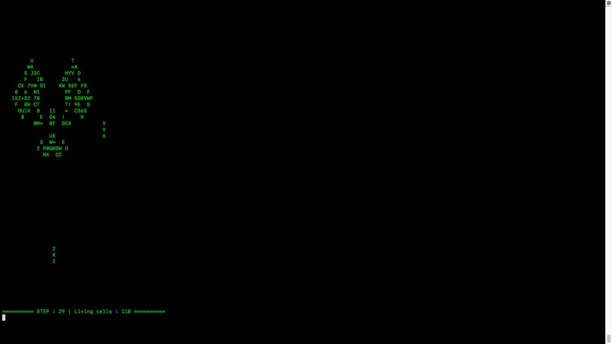

# golpy
ASCII-Based conway's game of life

### Usage

```
usage: gol.py [-h] [-s SPEED] [-m ROWS COLS] [path]

A simple Conway's game of life written in python

positional arguments:
  path                  path to the matrix file

optional arguments:
  -h, --help            show this help message and exit
  -s SPEED, --speed SPEED
                        change the speedrate of the screen refresh
  -m ROWS COLS, --matrix ROWS COLS
                        generate a file with a given size
```

The matrix file only contains 0 and 1 ; One stands for a living cell, zero for a dead one. The file is editable by hand.
Hence, it is, in a way, a simple interface for creating your own seeds.

### Examples
```
python3 gol.py new_matrix.txt -s 0.25
```


